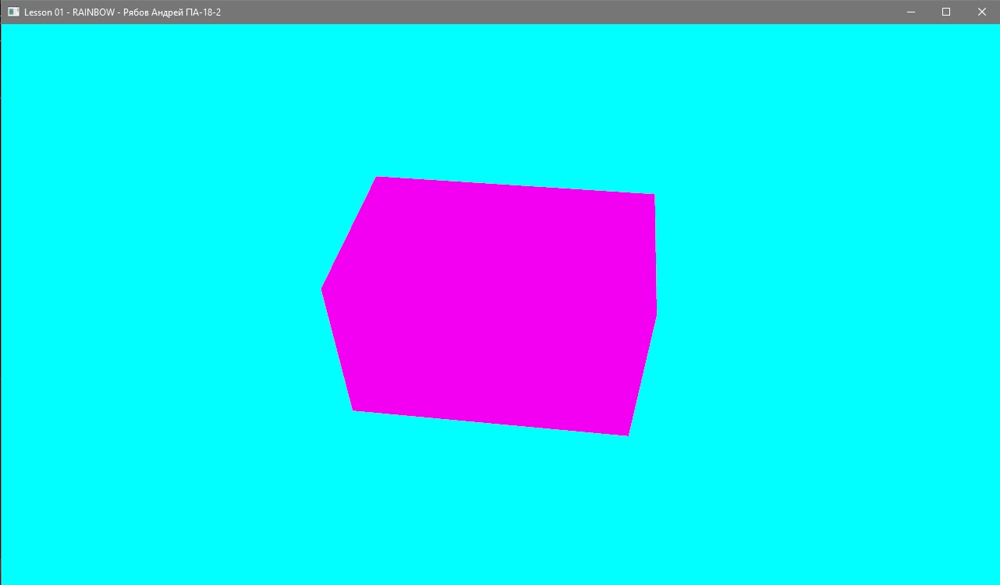
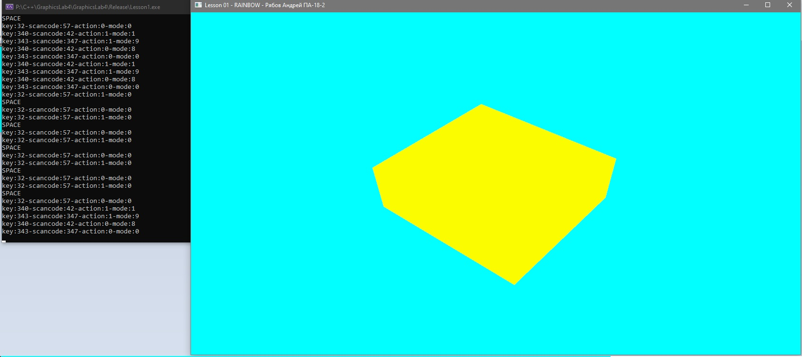

# GraphicsLab3
 
# Отчёт по лабораторной работе 3 по Графике GraphicsLab1<br>студента группы ПА-18-2<br>Рябова Андрея Дмитриевича

## Завдання
1. Ознайомитись з можливостями "GLShader.h". Розібратися з особливостями "GLShader.h" класу.
2. Використовуючи шаблон програми Task04Src [https://github.com/KnightDanila/GraphicProjects_OpenGL_Shaders_GLSL/tree/master/Lesson4/Task04Src] - запишіть та запустить код з вашим простором імен.
3. Завантажити "BrightAndDim_VertexShader.vs", "BrightAndDim_FragmentShader.fs" до робочої папки;
4. Додайте вивід до консолі:
```
Task 4
Author: Vasya Pupkin
```
5. Створіть шейдер за допомогою ...::GraphCore::GLShader* shaderBrightDim = new ...::GraphCore::GLShader("BrightAndDim_VertexShader.vs", "BrightAndDim_FragmentShader.fs");
6. Намалюйте об'єкт VBO (з лабораторної 2) - та додайте шейдер до нього
7. Додайте дію до клавіатури, щоб змінить колір у шейдері - додайте у main glfwSetKeyCallback(window, keyCallback); та напишіть :
```
void keyCallback(GLFWwindow * window, int key, int scancode, int action, int mode) {
	println((string) "key:" + key + "-scancode:" + scancode + "-action:" + action + "-mode:" + mode);

    if (key == GLFW_KEY_SPACE && action == GLFW_PRESS) {
        println("SPACE");
        //TO DO
    }
}
```
## Выполнение:
**Main.cpp**
```
#include <iostream>
#include <windows.h>
#include <cmath>
#include <numbers>
#include <cstdio>

//#pragma comment(lib, "libs\\GL_AL\\glfw3.lib")
//#pragma comment(lib, "libs\\GL_AL\\glut32.lib")
//#pragma comment(lib, "libs\\GL_AL\\glut32.dll")
//#pragma comment(lib, "libs\\GL_AL\\alut.lib")
//#pragma comment(lib, "libs\\GL_AL\\glew32.lib")
//#pragma comment(lib, "libs\\GL_AL\\glew32s.lib")
//
//#pragma comment(lib, "msvcrt.lib")
//#pragma comment(lib, "msvcmrt.lib")
//#pragma comment(lib, "legacy_stdio_definitions.lib")

#include "libs\GL_AL\glew.h"

#include "libs\GL_AL\glfw3.h"
#include "libs\GL_AL\glm\glm.hpp"
#include "libs\GL_AL\glm\gtc\matrix_transform.hpp"
#include "libs\GL_AL\glm\gtc\random.hpp"
//#include "libs\GL_AL\shader.h"

#include "libs\GL_AL\glut.h"
#include "libs\GL_AL\glm\gtc\type_ptr.hpp"


#define GLUT_DISABLE_ATEXIT_HACK
#include "libs\GL_AL\glew.h"
#include "libs\GL_AL\glfw3.h"
#include <iso646.h>


namespace Cube {
    float vertices[] = {
        -0.5f, -0.5f, -0.5f, 0.0f, 0.0f,
        0.5f, -0.5f, -0.5f, 1.0f, 0.0f,
        0.5f, 0.5f, -0.5f, 1.0f, 1.0f,
        0.5f, 0.5f, -0.5f, 1.0f, 1.0f,
        -0.5f, 0.5f, -0.5f, 0.0f, 1.0f,
        -0.5f, -0.5f, -0.5f, 0.0f, 0.0f,


        -0.5f, -0.5f, 0.5f, 0.0f, 0.0f,
        0.5f, -0.5f, 0.5f, 1.0f, 0.0f,
        0.5f, 0.5f, 0.5f, 1.0f, 1.0f,
        0.5f, 0.5f, 0.5f, 1.0f, 1.0f,
        -0.5f, 0.5f, 0.5f, 0.0f, 1.0f,
        -0.5f, -0.5f, 0.5f, 0.0f, 0.0f,


        -0.5f, 0.5f, 0.5f, 1.0f, 0.0f,
        -0.5f, 0.5f, -0.5f, 1.0f, 1.0f,
        -0.5f, -0.5f, -0.5f, 0.0f, 1.0f,
        -0.5f, -0.5f, -0.5f, 0.0f, 1.0f,
        -0.5f, -0.5f, 0.5f, 0.0f, 0.0f,
        -0.5f, 0.5f, 0.5f, 1.0f, 0.0f,


        0.5f, 0.5f, 0.5f, 1.0f, 0.0f,
        0.5f, 0.5f, -0.5f, 1.0f, 1.0f,
        0.5f, -0.5f, -0.5f, 0.0f, 1.0f,
        0.5f, -0.5f, -0.5f, 0.0f, 1.0f,
        0.5f, -0.5f, 0.5f, 0.0f, 0.0f,
        0.5f, 0.5f, 0.5f, 1.0f, 0.0f,


        -0.5f, -0.5f, -0.5f, 0.0f, 1.0f,
        0.5f, -0.5f, -0.5f, 1.0f, 1.0f,
        0.5f, -0.5f, 0.5f, 1.0f, 0.0f,
        0.5f, -0.5f, 0.5f, 1.0f, 0.0f,
        -0.5f, -0.5f, 0.5f, 0.0f, 0.0f,
        -0.5f, -0.5f, -0.5f, 0.0f, 1.0f,


        -0.5f, 0.5f, -0.5f, 0.0f, 1.0f,
        0.5f, 0.5f, -0.5f, 1.0f, 1.0f,
        0.5f, 0.5f, 0.5f, 1.0f, 0.0f,
        0.5f, 0.5f, 0.5f, 1.0f, 0.0f,
        -0.5f, 0.5f, 0.5f, 0.0f, 0.0f,
        -0.5f, 0.5f, -0.5f, 0.0f, 1.0f
    };
    // world space positions of our cubes
    glm::vec3 cubePositions[] = {
        glm::vec3(0.0f, 0.0f, 0.0f),
        glm::vec3(2.0f, 5.0f, -15.0f),
        glm::vec3(-1.5f, -2.2f, -2.5f),
        glm::vec3(-3.8f, -2.0f, -12.3f),
        glm::vec3(2.4f, -0.4f, -3.5f),
        glm::vec3(-1.7f, 3.0f, -7.5f),
        glm::vec3(1.3f, -2.0f, -2.5f),
        glm::vec3(1.5f, 2.0f, -2.5f),
        glm::vec3(1.5f, 0.2f, -1.5f),
        glm::vec3(-1.3f, 1.0f, -1.5f)
    };
    unsigned int VBO;
    unsigned int VAO;
    unsigned int texture1;
    unsigned int texture2;
    //Shader ourShader;


    void init() {


        {
            glGenBuffers(1, &VBO);
            glBindBuffer(GL_ARRAY_BUFFER, VBO);
            glBufferData(GL_ARRAY_BUFFER, sizeof(vertices), vertices, GL_STATIC_DRAW);


            // position attribute
            //glVertexAttribPointer(0, 3, GL_FLOAT, GL_FALSE, 5 * sizeof (float), (void*) 0);
            //glEnableVertexAttribArray(0);
            // texture coord attribute
            //glVertexAttribPointer(1, 2, GL_FLOAT, GL_FALSE, 5 * sizeof (float), (void*) (3 * sizeof (float)));
            //glEnableVertexAttribArray(1);
        }
    }


}

#include "GLRenderSystem.h"
#include "GLWindow.h";
#include "GLCamera.h"
#include "GLShader.h"

glm::vec3 RGB = glm::vec3(0);

using namespace std;

string operator+(string s, int i) {
    return s + to_string(i);
}

template < typename T>
void println(T i) {
    cout << i << endl;
}

void argsEcho(int argc, char** argv) {
	println("____ARGS____");
	if (argc == 0) {
		println("NO ARGS");
	}
	else {
		for (int i = 0; i < argc; i++) {
			println(argv[i]);
		}
	}
	println("____________\n");
}


void keyCallback(GLFWwindow* window, int key, int scancode, int action, int mode) {
    println((string)"key:" + key + "-scancode:" + scancode + "-action:" + action + "-mode:" + mode);

    if (key == GLFW_KEY_SPACE && action == GLFW_PRESS) {
        println("SPACE");
        RGB = glm::vec3(glm::linearRand(0, 1), glm::linearRand(0, 1), glm::linearRand(0, 1));
    }
}


int main(int argc, char** argv) {

	argsEcho(argc, argv);
	println("Hello World\nAuthor: Riabov Andrey");
	if (!glfwInit()) {
		fprintf(stderr, "Ошибка при инициализации GLFW\n");
		return -1;
	}


	rory::graph_core::GLRenderSystem* renderer = new rory::graph_core::GLRendererOld2_1();
	auto openGL33 = true;
	if (openGL33) {
		renderer = new rory::graph_core::GLRender();
	}
	else {
		renderer = new rory::graph_core::GLRendererOld2_1();
	}
	renderer->init();

	//auto win1 = new rory::GLWindow("Lesson 1", 640, 420);
	//auto win2 = new rory::GLWindow("Lesson 2", 640, 420);


	auto window = glfwCreateWindow(1280, 720, "Lesson 01 - RAINBOW - Рябов Андрей ПА-18-2", nullptr, nullptr);


	if (!window) {
		fprintf(
			stderr,
			"Невозможно открыть окно GLFW. Если у вас Intel GPU, то он не поддерживает версию 3.3. Попробуйте версию уроков для OpenGL 2.1.\n");
		glfwTerminate();
		return -1;
	}


	glfwMakeContextCurrent(window);
	glewExperimental = true;
	if (glewInit() != GLEW_OK) {
		fprintf(stderr, "Невозможно инициализировать GLEW\n");
		return -1;
	}

    glfwSetInputMode(window, GLFW_STICKY_KEYS, GL_TRUE);
    glfwSetKeyCallback(window, keyCallback);


    rory::GraphCore::Camera* CamFree = new rory::GraphCore::GLCameraFree();
    CamFree->setPerspective(glm::radians(45.0f), (float) 640 / 420, 0.01f, 1000.0f);

    rory::GraphCore::GLShader* shaderBrightDim = new rory::GraphCore::GLShader("BrightAndDim_VertexShader.vs", "BrightAndDim_FragmentShader.fs");

	while (glfwGetKey(window, GLFW_KEY_ESCAPE) != GLFW_PRESS && glfwWindowShouldClose(window) == 0) {
		glfwMakeContextCurrent(window);
        float angle = glfwGetTime() * 50.0f;
        CamFree->setPos(glm::vec3(2 * cos(angle * std::numbers::pi / 180), 2, 2 * sin(angle * std::numbers::pi / 180)));

        shaderBrightDim->use();
        shaderBrightDim->setVec3("rgb", RGB);
        shaderBrightDim->setMat4("modelView", CamFree->getMat4ModelView());
        shaderBrightDim->setMat4("modelProj", CamFree->getMat4ModelProj());
        shaderBrightDim->setFloat("time", glfwGetTime());

        renderer->render(window);

        glUseProgram(0);

        glfwPollEvents();
		glfwSwapBuffers(window);
	}

	glfwTerminate();
	return 0;
}

```
**GLRenderSystem.h**
```
#ifndef GLRENDERSYSTEM_H
#define GLRENDERSYSTEM_H

#include "libs\GL_AL\glew.h"
#include "libs\GL_AL\glfw3.h"

#include <cstdio>

namespace rory {
	namespace graph_core {
		class GLRenderSystem {
		public:
			virtual ~GLRenderSystem() = default;
			virtual void init() { }
			virtual void render(GLFWwindow* window) { }
			virtual void renderTriangleArray(GLfloat vertices[], GLfloat colors[]) { }
			virtual void renderVBO() { }
		};

		class GLRender final: public GLRenderSystem {
			void init() override {
				if (!glfwInit()) {
					fprintf(stderr, "Ошибка при инициализации GLFW\n");
					return;
				}
				glfwWindowHint(GLFW_SAMPLES, 4);
				glfwWindowHint(GLFW_CONTEXT_VERSION_MAJOR, 3);
				glfwWindowHint(GLFW_CONTEXT_VERSION_MINOR, 0);
				/*glfwWindowHint(GLFW_OPENGL_FORWARD_COMPAT, GL_TRUE);*/
			}
			void render(GLFWwindow* window) override {
				float colorRGB = 0.0;
				glClearColor(sin(colorRGB * std::numbers::pi / 180), abs(cos(colorRGB * std::numbers::pi / 180)), abs(sin(colorRGB * std::numbers::pi / 180) + cos(colorRGB * std::numbers::pi / 180)), 1.0f);
				glClear(GL_COLOR_BUFFER_BIT | GL_DEPTH_BUFFER_BIT);
				colorRGB <= 180 ? colorRGB += 0.1 : colorRGB = 0;
				glEnable(GL_DEPTH_TEST);
				glMatrixMode(GL_MODELVIEW);
				glPushMatrix();
				glRotatef(glfwGetTime() * 50.0f, 1.0, 1.0, 0.0); //apply transformation
				glGenBuffers(1, &Cube::VBO);
				glBindBuffer(GL_ARRAY_BUFFER, Cube::VBO);
				glBufferData(GL_ARRAY_BUFFER, sizeof(Cube::vertices), Cube::vertices, GL_STATIC_DRAW);
				glVertexPointer(3, GL_FLOAT, 0, nullptr);
				glBindBuffer(GL_ARRAY_BUFFER, Cube::VBO);
				glVertexAttribPointer(0, 3, GL_FLOAT, GL_FALSE, 5 * sizeof(float), static_cast<void*>(nullptr));
				glEnableVertexAttribArray(0);
				glEnableClientState(GL_VERTEX_ARRAY);
				glDrawArrays(GL_TRIANGLES, 0, sizeof(Cube::vertices) / sizeof(Cube::vertices[0] / 5));
				glPopMatrix();
				glDisableClientState(GL_VERTEX_ARRAY);
			}
			void renderTriangleArray(GLfloat vertices[], GLfloat colors[]) override { }
		};

		class GLRendererOld2_1: public GLRenderSystem {
			void init() override {
				if (!glfwInit()) {
					fprintf(stderr, "Ошибка при инициализации GLFW\n");
					return;
				}
				glfwWindowHint(GLFW_SAMPLES, 4);
				glfwWindowHint(GLFW_CONTEXT_VERSION_MAJOR, 2);
				glfwWindowHint(GLFW_CONTEXT_VERSION_MINOR, 1);
			}

			void render(GLFWwindow* window) override {
				float colorRGB = 0.0;
				glClearColor(sin(colorRGB * std::numbers::pi / 180), abs(cos(colorRGB * std::numbers::pi / 180)),
				             abs(sin(colorRGB * std::numbers::pi / 180) + cos(colorRGB * std::numbers::pi / 180)),
				             1.0f);
				glClear(GL_COLOR_BUFFER_BIT);
				{
					colorRGB <= 180 ? colorRGB += 0.1 : colorRGB = 0;
				}
				glLoadIdentity();
				glRotatef(static_cast<float>(glfwGetTime()) * 50.f, 0.f, 1.f, 0.f);
				glBegin(GL_TRIANGLES);
				///*glColor3f(sin(static_cast<float>(glfwGetTime())*5), 0.f, 0.f);*/
				//glColor3f((sin(glfwGetTime() / 2) + 1) / 2, (sin(glfwGetTime() / 2 + 1.5) + 1) / 2, (sin(glfwGetTime() / 2 + 1.0) + 1) / 2);
				//glVertex3f(-0.6f, -0.4f, 0.f);
				///*glColor3f(0.f, sin(static_cast<float>(glfwGetTime()) * 5), 0.f);*/
				//glColor3f((sin(glfwGetTime() / 2) + 1) / 2, (sin(glfwGetTime() / 2 + 1.5) + 1) / 2, (sin(glfwGetTime() / 2 + 1.0) + 1) / 2);
				//glVertex3f(0.6f, -0.4f, 0.f);
				///*glColor3f(0.f, 0.f, sin(static_cast<float>(glfwGetTime()) * 5));*/
				//glColor3f((sin(glfwGetTime() / 2) + 1) / 2, (sin(glfwGetTime() / 2 + 1.5) + 1) / 2, (sin(glfwGetTime() / 2 + 1.0) + 1) / 2);
				//glVertex3f(0.f, 0.6f, 0.f);
				glColor3f((sin(glfwGetTime() / 2) + 1) / 2, (sin(glfwGetTime() / 2 + 1.5) + 1) / 2,
				          (sin(glfwGetTime() / 2 + 1.0) + 1) / 2);
				glVertex3f(-0.6f, -0.4f, 0.f);
				glColor3f((sin(glfwGetTime() / 2 + 1.5) + 1) / 2, (sin(glfwGetTime() / 2 + 1.0) + 1) / 2,
				          (sin(glfwGetTime() / 2) + 1) / 2);
				glVertex3f(0.6f, -0.4f, 0.f);
				glColor3f((sin(glfwGetTime() / 2 + 1.0) + 1) / 2, (sin(glfwGetTime() / 2) + 1) / 2,
				          (sin(glfwGetTime() / 2 + 1.5) + 1) / 2);
				glVertex3f(0.f, 0.6f, 0.f);
				glEnd();
			}

			void renderTriangleArray(GLfloat vertices[], GLfloat colors[]) override {
				glClear(GL_COLOR_BUFFER_BIT);
				glEnableClientState(GL_VERTEX_ARRAY);
				glEnableClientState(GL_COLOR_ARRAY);
				glVertexPointer(3, GL_FLOAT, 0, vertices);
				glColorPointer(3, GL_FLOAT, 0, colors);
				glDrawArrays(GL_QUADS, 0, 8);
				glDisableClientState(GL_COLOR_ARRAY);
				glDisableClientState(GL_VERTEX_ARRAY);
			}
		};
	}
}

#endif

```
**GLWindow.h**
```
#ifndef GLWINDOW_H
#define GLWINDOW_H

#include "libs\GL_AL\glew.h"
#include "libs\GL_AL\glfw3.h"

namespace rory {
	class GLWindow {
	public:
		GLWindow(const std::string& title, uint32_t width, uint32_t height) : GLWindow(title, width, height, nullptr) {}

		GLWindow(const std::string& title, uint32_t width, uint32_t height, GLFWwindow* share) {
			this->window_ = glfwCreateWindow(width, height, title.c_str(), nullptr, share);
		}
		~GLWindow() {
			glfwSetWindowShouldClose(this->window_, 1);
		};
		[[nodiscard]] uint32_t get_width() const {
			int* width = nullptr;
			int* height = nullptr;
			glfwGetWindowSize(this->window_, width, height);
			return *width;
		};
		[[nodiscard]] uint32_t get_height() const {
			int* width = nullptr;
			int* height = nullptr;
			glfwGetWindowSize(this->window_, width, height);
			return *height;
		};
		[[nodiscard]] GLFWwindow* get_glfw_handle() const {
			return this->window_;
		};
	private:
		GLFWwindow* window_;
	};
}
#endif GLWINDOW_H 
```
**GLCamera.h**
```
#ifndef GLCAMERA_H
#define GLCAMERA_H

#include "libs\GL_AL\glew.h"
#include "libs\GL_AL\glfw3.h"

#include <cstdio>

namespace rory {
    namespace GraphCore {

        class Camera {
        public:

            virtual void setPerspective(float fov, float aspect, float near, float far) {

            };

            virtual void setPos(glm::vec3 pos) {
            };

            virtual void setTarget(glm::vec3 pos) {

            };

            virtual void start() {

            };

            virtual void end() {

            };

            virtual glm::vec3 getPos() = 0;

            virtual glm::mat4 getMat4ModelView() = 0;
            virtual glm::mat4 getMat4ModelProj() = 0;


        protected:

            glm::mat4 _modelproj = glm::mat4(0.0f);
            glm::vec3 _pos = glm::vec3(0.0f);
            glm::vec3 _direction = glm::vec3(0.0f);
            glm::mat4 _modelview = glm::mat4(0.0f);
        };

        class GLCameraFree : public Camera {
        public:

            void setPerspective(float fov, float aspect, float near1, float far1) {


                glMatrixMode(GL_PROJECTION);
                _modelproj = glm::perspective(fov, aspect, near1, far1);
                glLoadMatrixf(glm::value_ptr(_modelproj));


            };

            void setPos(glm::vec3 pos) {
                glm::vec3 target = glm::vec3(0.0f);
                glm::vec3 direction = glm::normalize(pos - target);
                _modelview = glm::lookAt(pos, direction, glm::vec3(0, 1, 0));

            }

            void start() {
                glMatrixMode(GL_MODELVIEW);
                glPushMatrix();
                glLoadMatrixf(glm::value_ptr(_modelview));
            }

            void end() {
                glPopMatrix();
            }

            glm::vec3 getPos() {
                return glm::vec3(0);
            };

            glm::mat4 getMat4ModelView() {
                return _modelview;
            };

            glm::mat4 getMat4ModelProj() {
                return _modelproj;
            };
        };

        class GLCameraTarget : public Camera {
            
        };


    };
}

#endif /* GLCAMERA_H */

```
**GLShader.h**
```
#ifndef GLSHADER_H
#define GLSHADER_H

//#include <glad/glad.h>
//#include <glm/glm.hpp>

#include <string>
#include <fstream>
#include <sstream>
#include <iostream>


namespace rory {
    namespace GraphCore {

        class GLShader {
        public:
            unsigned int ID;
            // constructor generates the shader on the fly
            // ------------------------------------------------------------------------

            GLShader() {


            }

            GLShader(const char* vertexPath, const char* fragmentPath, const char* geometryPath = nullptr) {
                // 1. retrieve the vertex/fragment source code from filePath
                std::string vertexCode;
                std::string fragmentCode;
                std::string geometryCode;
                std::ifstream vShaderFile;
                std::ifstream fShaderFile;
                std::ifstream gShaderFile;
                // ensure ifstream objects can throw exceptions:
                vShaderFile.exceptions(std::ifstream::failbit | std::ifstream::badbit);
                fShaderFile.exceptions(std::ifstream::failbit | std::ifstream::badbit);
                gShaderFile.exceptions(std::ifstream::failbit | std::ifstream::badbit);
                try {
                    // open files
                    vShaderFile.open(vertexPath);
                    fShaderFile.open(fragmentPath);
                    std::stringstream vShaderStream, fShaderStream;
                    // read file's buffer contents into streams
                    vShaderStream << vShaderFile.rdbuf();
                    fShaderStream << fShaderFile.rdbuf();
                    // close file handlers
                    vShaderFile.close();
                    fShaderFile.close();
                    // convert stream into string
                    vertexCode = vShaderStream.str();
                    fragmentCode = fShaderStream.str();
                    // if geometry shader path is present, also load a geometry shader
                    if (geometryPath != nullptr) {
                        gShaderFile.open(geometryPath);
                        std::stringstream gShaderStream;
                        gShaderStream << gShaderFile.rdbuf();
                        gShaderFile.close();
                        geometryCode = gShaderStream.str();
                    }
                } catch (std::ifstream::failure e) {
                    std::cout << "ERROR::SHADER::FILE_NOT_SUCCESFULLY_READ" << std::endl;
                }
                const char* vShaderCode = vertexCode.c_str();
                const char * fShaderCode = fragmentCode.c_str();
                // 2. compile shaders
                unsigned int vertex, fragment;
                // vertex shader
                vertex = glCreateShader(GL_VERTEX_SHADER);
                glShaderSource(vertex, 1, &vShaderCode, NULL);
                glCompileShader(vertex);
                checkCompileErrors(vertex, "VERTEX");
                // fragment Shader
                fragment = glCreateShader(GL_FRAGMENT_SHADER);
                glShaderSource(fragment, 1, &fShaderCode, NULL);
                glCompileShader(fragment);
                checkCompileErrors(fragment, "FRAGMENT");
                // if geometry shader is given, compile geometry shader
                unsigned int geometry;
                if (geometryPath != nullptr) {
                    const char * gShaderCode = geometryCode.c_str();
                    geometry = glCreateShader(GL_GEOMETRY_SHADER);
                    glShaderSource(geometry, 1, &gShaderCode, NULL);
                    glCompileShader(geometry);
                    checkCompileErrors(geometry, "GEOMETRY");
                }
                // shader Program
                ID = glCreateProgram();
                glAttachShader(ID, vertex);
                glAttachShader(ID, fragment);
                if (geometryPath != nullptr)
                    glAttachShader(ID, geometry);
                glLinkProgram(ID);
                checkCompileErrors(ID, "PROGRAM");
                // delete the shaders as they're linked into our program now and no longer necessery
                glDeleteShader(vertex);
                glDeleteShader(fragment);
                if (geometryPath != nullptr)
                    glDeleteShader(geometry);

            }
            // activate the shader
            // ------------------------------------------------------------------------

            void use() {
                glUseProgram(ID);
            }
            // utility uniform functions
            // ------------------------------------------------------------------------

            void setBool(const std::string &name, bool value) const {
                glUniform1i(glGetUniformLocation(ID, name.c_str()), (int) value);
            }
            // ------------------------------------------------------------------------

            void setInt(const std::string &name, int value) const {
                glUniform1i(glGetUniformLocation(ID, name.c_str()), value);
            }
            // ------------------------------------------------------------------------

            void setFloat(const std::string &name, float value) const {
                glUniform1f(glGetUniformLocation(ID, name.c_str()), value);
            }
            // ------------------------------------------------------------------------

            void setVec2(const std::string &name, const glm::vec2 &value) const {
                glUniform2fv(glGetUniformLocation(ID, name.c_str()), 1, &value[0]);
            }

            void setVec2(const std::string &name, float x, float y) const {
                glUniform2f(glGetUniformLocation(ID, name.c_str()), x, y);
            }
            // ------------------------------------------------------------------------

            void setVec3(const std::string &name, const glm::vec3 &value) const {
                glUniform3fv(glGetUniformLocation(ID, name.c_str()), 1, &value[0]);
            }

            void setVec3(const std::string &name, float x, float y, float z) const {
                glUniform3f(glGetUniformLocation(ID, name.c_str()), x, y, z);
            }
            // ------------------------------------------------------------------------

            void setVec4(const std::string &name, const glm::vec4 &value) const {
                glUniform4fv(glGetUniformLocation(ID, name.c_str()), 1, &value[0]);
            }

            void setVec4(const std::string &name, float x, float y, float z, float w) {
                glUniform4f(glGetUniformLocation(ID, name.c_str()), x, y, z, w);
            }
            // ------------------------------------------------------------------------

            void setMat2(const std::string &name, const glm::mat2 &mat) const {
                glUniformMatrix2fv(glGetUniformLocation(ID, name.c_str()), 1, GL_FALSE, &mat[0][0]);
            }
            // ------------------------------------------------------------------------

            void setMat3(const std::string &name, const glm::mat3 &mat) const {
                glUniformMatrix3fv(glGetUniformLocation(ID, name.c_str()), 1, GL_FALSE, &mat[0][0]);
            }
            // ------------------------------------------------------------------------

            void setMat4(const std::string &name, const glm::mat4 &mat) const {
                glUniformMatrix4fv(glGetUniformLocation(ID, name.c_str()), 1, GL_FALSE, &mat[0][0]);
            }

        private:
            // utility function for checking shader compilation/linking errors.
            // ------------------------------------------------------------------------

            void checkCompileErrors(GLuint shader, std::string type) {
                GLint success;
                GLchar infoLog[1024];
                if (type != "PROGRAM") {
                    glGetShaderiv(shader, GL_COMPILE_STATUS, &success);
                    if (!success) {
                        glGetShaderInfoLog(shader, 1024, NULL, infoLog);
                        std::cout << "ERROR::SHADER_COMPILATION_ERROR of type: " << type << "\n" << infoLog << "\n -- --------------------------------------------------- -- " << std::endl;
                    }
                } else {
                    glGetProgramiv(shader, GL_LINK_STATUS, &success);
                    if (!success) {
                        glGetProgramInfoLog(shader, 1024, NULL, infoLog);
                        std::cout << "ERROR::PROGRAM_LINKING_ERROR of type: " << type << "\n" << infoLog << "\n -- --------------------------------------------------- -- " << std::endl;
                    }
                }
            }
        };

    };
};
#endif
```
## Работа программы:



## Вывод:

Я ознакомился с особенностями работы библиотеки OpenGL.
Библиотека позволяет при помощи простых функций работать с визуальными возможностями окна. Сделал простую заготовку с выводом текста в консоль и изменением названия окна. Программа - заготовка *RAINBOW* от [DanillaKnight](https://github.com/KnightDanila).
 
